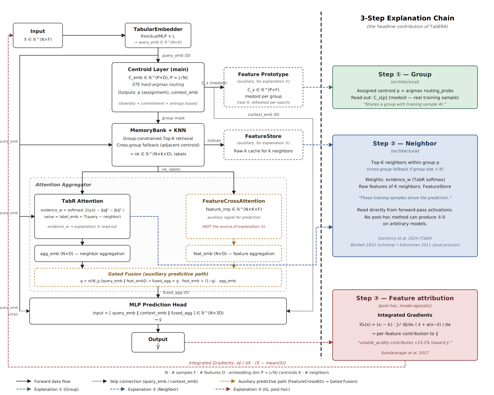

# TabERA

**Tabular Explainable Retrieval Architecture**

A retrieval-augmented tabular model that produces architectural, example-based explanations alongside its predictions.

---

## Background

Deep tabular models increasingly match or exceed gradient-boosted trees on many benchmarks, but their predictions are opaque by default. The standard fix is post-hoc attribution (SHAP, LIME, Integrated Gradients) — but these methods only ever answer one kind of question, "which input features mattered," and do so *after the fact*, disconnected from what the model actually computed internally.

Retrieval-augmented tabular models (e.g., TabR, Gorishniy et al. 2023) suggest a different path: if a model predicts by comparing a query to stored training examples, the retrieval step itself is a second, richer kind of explanation — "which group does this belong to" and "which other data points is this prediction like" — one that no post-hoc method can produce for an arbitrary model, because it requires the architecture to explicitly organize and query training examples at inference time.

TabERA is built around this idea: a centroid-conditioned retrieval architecture where group assignment and neighbor retrieval are load-bearing parts of the forward pass, not add-ons, so the explanations they produce are guaranteed to reflect what the model actually did — with feature-level attribution (via Integrated Gradients) added as a complementary, standard third layer.

---

## Architecture



```
Query → Embedding → Centroid Routing (macro) → Group-constrained KNN (micro) → Prediction
                          ↓                              ↓                         ↓
                    "Which group?"              "Which neighbors?"          "Which features?"
                    (architectural)              (architectural)             (post-hoc, IG)
```

Given `X ∈ ℝ^(N×F)` (D = embedding dim, P = centroids, K = neighbors):

1. **Embed** — `TabularEmbedder` maps `X → query_emb ∈ ℝ^D`.
2. **Route (→ explanation ①)** — `CentroidLayer` assigns each sample to one of `P` learnable centroids via STE hard-argmax on cosine similarity, producing `hard_assignment`, `context_emb`, and `centroid_x` (the medoid — nearest real training sample, used to make ① human-readable).
3. **Retrieve & aggregate (→ explanation ②)** — `MemoryBank` performs a K-nearest-neighbor search restricted to the sample's centroid (with cross-group fallback if the group is smaller than K). `AttentionAggregator` converts neighbor similarities into `evidence_w` (TabR-style softmax) and aggregates into `agg_emb`, which feeds the prediction head directly.
4. **Predict** — `[query_emb ‖ context_emb ‖ agg_emb] → MLP head → ŷ`.

A third explanation, ③ (feature attribution via Integrated Gradients), is computed afterward by differentiating `ŷ` with respect to `X`, independent of stages 2–3.

**Key design decisions:**
- **Dual-Space Centroid** — each centroid keeps a learnable `centroid_emb` (routing/retrieval) and a `centroid_x` (real training sample, medoid-updated each epoch), so ① shows an actual data point rather than a synthetic average.
- **STE Routing** — forward uses discrete argmax for crisp groups; backward substitutes the softmax gradient so `C_emb` stays trainable, active at both train and eval time.
- **Cross-group Fallback** — expands to the nearest adjacent centroid rather than a global search when a group is small, preserving the semantics of ②.
- **Auxiliary Losses** — `diversity_loss` (spreads centroids apart) and `commitment_loss` (pulls queries to their assigned centroid), together with epoch-wise medoid updates, maintain meaningful group structure across datasets.

---

## Explanations

| Level | Module | Type | Explains |
|---|---|---|---|
| ① Group context | CentroidLayer (`centroid_x`) | Architectural | "This sample belongs to the high-alcohol, low-pH group" |
| ② Neighbor evidence | MemoryBank + AttentionAggregator (`evidence_w`) | Architectural | "Neighbor #1 contributes 42%" |
| ③ Feature attribution | Integrated Gradients | Post-hoc | "`volatile_acidity` has the largest attribution" |

**Sample output:**
```
① Group context      → Centroid_3 (conf. 94.3%): alcohol=10.24, pH=3.31
② Neighbor evidence   → #0 42.1%: alcohol=10.41, pH=3.28
③ Feature attribution → volatile_acidity 15.1%
```

①② are guaranteed by construction — `hard_assignment` and `evidence_w` are read directly off the forward pass, so what's reported is exactly what the model used:

| Explanation | Guarantee | Verified by |
|---|---|---|
| ① Group context | `hard_assignment` read directly from `routing_probs` | `--ablation dual_space_faithfulness` |
| ② Neighbor evidence | `evidence_w` is the same tensor used to compute `agg_emb` | `--ablation random_neighbor` |

*(Caveat: cross-group fallback can widen "neighbor within your group" more than expected — 75% of samples on the smallest dataset tested vs. 7–14% on larger ones.)*

③ (IG) is post-hoc and measured, not guaranteed — but the case for it isn't attribution quality. Against SHAP (medoid background, deletion/insertion AUC, paired Wilcoxon), only 3 of 8 comparisons reach significance and direction is mixed:

| Dataset | Deletion ↓ (TabERA / SHAP) | Insertion ↑ (TabERA / SHAP) |
|---|---|---|
| `vehicle` | 0.676 / 0.623 (n.s.) | 0.736 / 0.716 (n.s.) |
| `ada_agnostic` | 0.794 / 0.784 (SHAP, p=0.01) | 0.854 / 0.850 (n.s.) |
| `qsar-biodeg` | 0.724 / 0.732 (n.s.) | 0.885 / 0.848 (n.s., p=0.08) |
| `wine_quality` | 0.466 / 0.512 (SHAP, p<0.01) | 0.569 / 0.516 (TabERA, p<0.001) |

*(n.s. = not significant, Wilcoxon p≥0.05.)*

We use IG anyway because it fits the architecture: it needs only the gradient TabERA's STE routing already produces and a single baseline point, versus SHAP's per-feature sampling budget and background distribution. That baseline is also already sitting in the architecture — using the centroid medoid (the same one behind ①) instead of the dataset mean cuts IG's completeness error from 19–319% to 1.5–17.5%, since the mean typically falls outside any centroid's region. So the case for IG here is cost and structural fit, not superior accuracy — ①② remain TabERA's primary contribution regardless.

**Cognitive inspiration** (conceptual motivation only): Central Tendency (Posner & Keele, 1968), Schema Theory (Bartlett, 1932), Dual-Process theory (Kahneman, 2011).

---

## Performance

Prediction quality (HPO-tuned, seed=1 unless noted) on the four datasets used for the faithfulness analysis above:

| Dataset | Task | Test Acc | Test AUROC | Test F1 |
|---|---|---|---|---|
| `vehicle` (N=846) | 4-class | 0.765 | 0.937 | 0.762 |
| `ada_agnostic` (N=4,562) | binary | 0.801 | 0.858 | 0.735 |
| `qsar-biodeg` (N=1,055) | binary | 0.811 | 0.856 | 0.780 |
| `wine_quality` (N=6,497) | 7-class | 0.586 | 0.757 | 0.284 |

These are single-run illustrative numbers rather than a full leaderboard; `run_tabzilla.ps1` runs the same pipeline across a 36-dataset TabZilla benchmark for a broader comparison against standard tabular baselines.

---

## Contribution

- **Architecturally-guaranteed explanations (①②)** that no post-hoc method can produce for an arbitrary model — group membership and neighbor evidence are read directly off the forward pass, not estimated afterward.
- **A structural fix for IG's baseline-selection problem**: reusing the model's own centroid medoid as the Integrated Gradients baseline improves completeness by 8–78× over the conventional dataset-mean baseline, something only a retrieval-augmented architecture can offer.
- **A principled, low-cost case for gradient-based attribution over sampling-based attribution here**: IG needs only the gradient TabERA's STE routing already produces and one baseline point, performs on par with SHAP empirically, and is cheaper — not a quality trade-off, just the right tool for this architecture.
- **A documented limitation** of group-constrained retrieval: cross-group fallback rate depends on how `K` compares to the automatically-determined group size (`P = √N_train`), and can dominate on small datasets — a concrete design consideration for anyone adapting this architecture.

---

## Components

| File | Component | Role |
|---|---|---|
| `libs/prototypes.py` | CentroidLayer | STE routing, KMeans++ init, medoid update — ① |
| `libs/tabera.py` | TabERA, MemoryBank | Model, group-constrained KNN store — ② |
| `libs/evidence.py` | AttentionAggregator | `evidence_w`, direct retrieval path — ② |
| `libs/supervised.py` | TabERAWrapper | Training loop, EMA regrouping, early stopping |
| `libs/search_space.py` | HPO space | 9 params (Optuna) + auto `n_prototypes` |
| `libs/data.py` | TabularDataset | OpenML loader |
| `libs/eval.py` | Metrics | Accuracy, F1, AUROC, Logloss |
| `optimize.py` | HPO runner | Auto-sets `n_prototypes = sqrt(N_train)` |
| `reproduce.py` | Reproducer | Best config, `--explain` (①②③), `--ablation` (faithfulness) |
| `visualize_embeddings.py` | Visualizer | Embedding structure, class pies, KNN closeups |

---

## Installation & Usage

```bash
python -m venv venv && source venv/bin/activate
pip install torch --index-url https://download.pytorch.org/whl/cu128
pip install -r requirements.txt
```

```bash
# HPO
python optimize.py --gpu_id 0 --openml_id 11 --n_trials 100 --seed 1

# Reproduce best config (+ explanations)
python reproduce.py --gpu_id 0 --openml_id 11 --seed 1 --explain

# Faithfulness / ablations
python reproduce.py --gpu_id 0 --openml_id 11 --seed 1 --ablation rank_correlation

# TabZilla benchmark (36 datasets)
.\run_tabzilla.ps1
```

---

## HPO parameters (9 searched)

| Parameter | Range | Role |
|---|---|---|
| `embed_dim` | {64, 128, 256} | Embedding dim D |
| `k` | {8, 16, 32, 64} | KNN neighbors |
| `embedder_layers` | 1–4 | ResidualMLP depth |
| `dropout` | 0.0–0.5 | — |
| `loss_diversity` | 5e-2–5e-1 | Centroid spread penalty |
| `loss_commitment` | 1e-2–1e-1 | Query-centroid commitment |
| `lr` | 1e-4–1e-2 | — |
| `weight_decay` | 1e-6–1e-2 | — |
| `batch_size` | {128, 256, 512} | — |

> `n_prototypes` (P) is **not** searched — auto-set as `P = sqrt(N_train)` (min 4). Ranges P≈12 (`lymph`, N=148) to P≈185 (`nomao`, N=34,465).

---

## Project structure

```
TabERA/
├── libs/
│   ├── tabera.py            # Model, MemoryBank — ②
│   ├── prototypes.py        # CentroidLayer — ①
│   ├── evidence.py          # AttentionAggregator — ②
│   ├── supervised.py        # Training wrapper
│   ├── eval.py
│   ├── search_space.py      # HPO space
│   └── data.py              # OpenML loader
├── optim_logs/ / figures/
├── optimize.py / reproduce.py / visualize_embeddings.py
└── requirements.txt
```

---

## References

- Gorishniy et al. (2023). TabR: Tabular Deep Learning Meets Nearest Neighbors. *arXiv:2307.14338*.
- van den Oord et al. (2017). Neural Discrete Representation Learning (VQ-VAE). *NeurIPS*.
- Bengio et al. (2013). Estimating or Propagating Gradients Through Stochastic Neurons. *arXiv:1308.3432*.
- Sundararajan et al. (2017). Axiomatic Attribution for Deep Networks. *ICML*.
- Arthur & Vassilvitskii (2007). k-means++. *SODA*.
- Posner & Keele (1968). On the genesis of abstract ideas. *J. Exp. Psych.* 77(3).
- Bartlett (1932). *Remembering*. Cambridge University Press.
- Kahneman (2011). *Thinking, Fast and Slow*. Farrar, Straus and Giroux.
- McElfresh et al. (2023). When Do Neural Nets Outperform Boosted Trees on Tabular Data? *NeurIPS*.